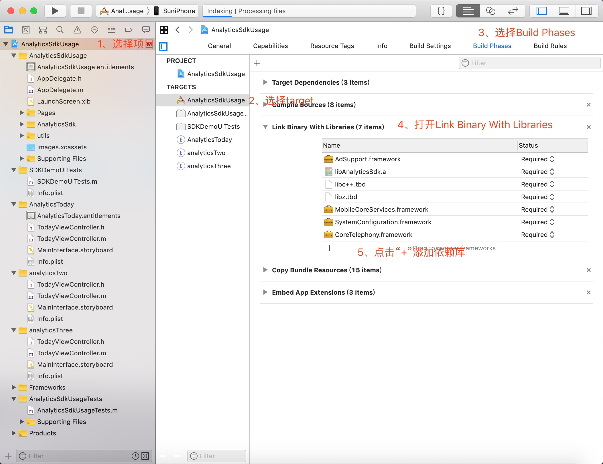

# iOS端 QDAS SDK集成指南

## 适用范围
QDAS App Analytics iOS SDK适用于iOS 8.0及以上操作系统。
支持Xcode10及其以上打包APP，如果Xcode10以下打包APP，可以联系我们申请获取SDK。

## 集成准备-创建应用并获取App Key
App Key是QDAS分析平台标识一款独立应用/游戏的唯一标识，
集成SDK前需要在QDAS报表中创建应用/游戏并获取相应的App Key。

**步骤：**

1）注册并登录https://www.qdas.com/ ，选择App Analytics产品线

2）创建应用并获取App Key

3）如果已创建的应用，请从“应用管理->基本信息”中查看App Key。

**说明：** TalkingData支持多平台使用相同的App Key。

## 快速集成-导入SDK

1、选择 `File` --> `Add Files to“Your Project”`
 
2、选择`QHStartAgent.h`和`libAnalyticsSdk.a`
 
3、勾选`Copy items if needed`
 
4、确保需要用到SDK的`targets`都处于勾选状态。
 

## 快速集成-添加依赖系统库
| 权限 | 用途 |
| :---------| :----------- | 
| `AdSupport.framework`    | 获取advertisingIdentifier | 
| `CoreTelephony.framework`    | 获取运营商标识 | 
| `Security.framework`    | 辅助存储设备标识 | 
| `SystemConfiguration.framework`    | 检测网络状况 | 
| `libz.tbd    `    | 进行数据压缩。Xcode7以下:`libz.dylib` | 
| `libc++.tbd`| 支持最新的c++11标准|

### 如图：

## 快速集成-添加编译参数
在Linking下的Other Linker Flags中添加“-ObjC”参数，该参数是使用灵动分析SDK的必要条件。
未添加会造成使用灵动分析时，在报表平台中获得的App截图为空白的情况。 

## 快速集成-SDK初始化
在 `AppDelegate.m` 文件中导入 `QHStartAgent.h` ，
并在 application:didFinishLaunchingWithOptions: 方法中初始化 App Analytics SDK。
示例代码：
~~~{.Objective-C}
#import "QHStartAgent.h"

- (BOOL)application:(UIApplication *)application didFinishLaunchingWithOptions:(NSDictionary *)launchOptions{ 
// App KEy: 在 App Analytics 创建应用后，进入数据报表页中，在“系统设置”-“编辑应用”页面里查看App Key。
// 渠道 ID: 是渠道标识符，可通过不同渠道单独追踪数据。
[QHStatAgent startWithAppkey:@"您的 App Key" channelId:@"渠道 ID"];

//other code
}

~~~
## 基础-基础统计
正确完成初始化调用后，自动完成应用启动的统计，详见集成步骤：SDK初始化。
基于应用启动，后台自动计算独立设备，并计算新增、活跃、留存、升级等指标。

## 基础-渠道统计
#### 1、用途和用法
给应用的安装包打入特殊的渠道标记，用户安装并使用后，
就可以在报表中分不同渠道来源单独查询相应的数据。
在您为应用商店、下载站等分发渠道提供应用安装包时，
可以加入渠道标记；在进行特别的活动时也可加入特殊渠道标记便于单独分析效果。

注意事项：
用户的渠道归属：每台设备仅记录到首次安装激活的渠道，
同一用户在更替渠道包使用后不会重复计算新增，使用数据归入首次激活渠道。
如果未添加渠道标记，或渠道标记是示例代码中的默认值，用户将会归入为“未知渠道”。

#### 2、集成方式说明
在初始化中写入渠道ID即可。

## 基础-账户
#### 登录
#### **1、用途和用法**
登录接口用于记录用户在使用应用过程中的登录行为。常用的调用登录接口的时机如下：
 
1）用户注册后自动登录，这时候可以调用登录接口；
 
2）用户登录信息过期，手动发起并完成登录操作，此时调用登录接口；
 
3）用户登录信息未过期，每次启动应用时App自动判断为已登录状态，开发者按需调用登录接口。
 

#### **2、接口及参数**
~~~{.Objective-C}
/**active user sign-in.
*  使用sign-In函数后，如果结束该UID的统计，需要调用sign-Off函数
*
*  @param userId : user's ID
*  @param provider  : 不能以下划线"_"开头，使用大写字母和数字标识; 如果是上市公司，建议使用股票代码。
*/
+ (void)profileSignInWithUID:(nullable NSString *)userId;

+ (void)profileSignInWithUID:(nullable NSString *)userId provider:(nullable NSString *)provider;

~~~

#### **3、示例**
某用户调用微信进行登录，账户ID为：1234567，昵称为：Sun。调用如下：

~~~{.Objective-C}
[QHStatAgent profileSignInWithUID: @"1234567" provider:@"weixin"];
~~~
## 基础-错误报告
#### **1、用途和用法**
 
收集应用的错误日志可帮助您来修正BUG、改善产品。报表中，我们除了提供错误次数的数据外，还提供错误的详细信息：错误发生时间，堆栈调用情况，并会对错误进行合理分类。
 

#### **注意事项:**
 
1）异常信息收集会损耗最终用户流量，因此自动捕获默认为关闭状态，您可根据需要开启此功能。
 
2）方法调用须在各个平台初始化后尽早调用。

#### **2、接口及参数**
自动获取异常信息，在 `application:didFinishLaunchingWithOptions:`方法中调用：
~~~{.Objective-C}
/**
*  设置上报错误信息
*
*  @param isEnabled BOOL类型 默认 NO
*/
+ (void)setCrashReportEnabled:(BOOL)isEnabled;
~~~

## 高级-页面访问
#### **1、用途和用法**
此功能用于帮助开发者统计应用中各个页面的访问次数和停留时长，并可以追踪用户从某个页面离开后所访问的其他页面，为产品优化提供依据。

#### **注意事项：**
1）进入页面和离开页面的接口必须同时调用；
 
2）尽可能对所有页面都进行追踪，以免因部分页面为追踪而导致分析用户跳转路径时分析结果异常。
#### **2、接口及参数**
接口：

**Step1:** 在 `viewDidAppear` 方法里调用 `onPageBegin`方法：
~~~{.Objective-C}
+ (void)onPageBegin:(nonnull NSString *)pageName;
~~~

**Step2:** `viewDidDisappear`方法里调用`onPageEnd`方法：

~~~{.Objective-C}
+ (void)onPageEnd:(nonnull NSString *)pageName;
~~~
#### **注意事项:**

`onPageBegin` 和 `onPageEnd` 必须成对调用。
#### **参数:**
| 参数 | 类型 |描述 |
| :---------| :----------- |  :----------- | 
| pageName |NSString| 页面名称。  最多包含64个字符，支持中文、英文、数字、下划线，  但不能包含空格或其他的转义字符 |

#### **3、示例**
用户使用ADAS移动App，访问App的某个页面：应用首页，停留30s后离开首页，继续访问应用的设置页面。调用方式如下；
~~~{.Objective-C}
[QHStatAgent onPageBegin:@"应用首页"];
[QHStatAgent onPageEnd:@"应用首页"];
[QHStatAgent onPageBegin:@"设置页面"];
~~~
说明：SDK会自动统计页面停留时长及来源页面。

##高级-自定义事件
#### **1、用途和用法**
自定义事件用于追踪任何需要了解的用户行为，如：用户点击某功能按钮、填写某个输入框、触发了某个广告等。

##### 2）**自定义事件名称（EventName）**
在QDAS分析平台，无需提前在报表中定义自定义事件名称，通过调用追踪代码时直接写入事件ID即可。报表中事件管理页面支持对EventID重命名。

#### **2、代码事件介绍**
代码事件是通过在代码中对每个需要追踪的自定义事件调用接口，传入相应参数从而实现对自定义事件追踪的方式。

#### **3、代码事件接口及参数**
**接口：** 
~~~{.Objective-C}
/**
*
*  使用前，请先到QDAS管理后台的设置->编辑自定义事件 中添加相应的事件ID，然后在工程中传入相应的事件ID
*  sdk内部参数使用，$符号开头，自定义字段还请避免使用$开头。
*  @param eventId 事件ID
*/
+ (void)onEvent:(nonnull NSString *)eventId;

+ (void)onEvent:(nonnull NSString *)eventId attributes:(nullable NSDictionary *)attributes;

/**
*   立即上传缓存的事件。
*/
+ (void)uploadEvent;

/**
*  添加一个错误事件。错误事件是事件ID为$custom_error的特殊事件。
*  @param exception 错误对象
*/
+ (void)onError:(nonnull NSException *)exception;

~~~
#### **参数:**
| 参数 | 类型 |描述 |
| :---------| :----------- |  :----------- | 
| eventId |NSString| 页面名称。  最多包含64个字符，支持中文、英文、数字、下划线，  但不能包含空格或其他的转义字符 |
| attributes |NSString| 自定义事件的参数及参数取值。   其中的Key为NSString，Value仅支持字符串（NSString）和数字（NSNumber）类型，其他类型则会被作为异常丢弃。   报表中将给出事件发生时每种value出现的频次。   在value取值较离散情况下（如示例中收集的促销价格信息），不要直接填充具体数值，而应划分区间后传入（如9.9元，可定义5～10元的价格区间，传入5～10元），否则value不同取值很可能超过平台最大数目限制，离散数据也对分析人员阅览数据造成影响。|
#### **4、代码事件示例**
**示例1：**
追踪某电商应用中首页的5个不同推广位置的点击次数，并收集宣传品的品类、促销价格等信息。因为是5个近似场景，对参数取值做了分组处理（如9.9元，可定义5～10元的价格区间，传入5～10元），避免取值太离散而影响分析甚至超过分析平台所支持的数量限制。调用如下：
~~~{.Objective-C}
// 可定义eventId=点击首页推荐位；
NSMutableDictionary *dic = [NSMutableDictionary dictionary];
[dic setObject:@"第一广告位" forKey:@"广告位"];
[dic setObject:@"服装" forKey:@"商品类别"];
[dic setObject:@"5~10" forKey:@"price"];
[QHStatAgent onEvent: @"首页推荐位点击" attributes:dic];

NSMutableDictionary *dic2 = [NSMutableDictionary dictionary];
[dic2 setObject:@"第二广告位" forKey:@"广告位"];
[dic2 setObject:@"家电" forKey:@"商品类别"];
[dic2 setObject:@"500~1000" forKey:@"price"];
[QHStatAgent onEvent: @"首页推荐位点击" attributes:dic];

~~~

**示例2：**
在一款休闲游戏中记录玩家在各关卡中的失败数据，并收集玩家具体信息。调用如下：
~~~{.Objective-C}
// 可定义eventId=战斗失败
NSMutableDictionary *dic = [NSMutableDictionary dictionary];
[dic setObject:@"20-30" forKey:@"等级"];//级别区间
[dic setObject:@"沼泽地阿卡村" forKey:@"关卡名"]; //关卡名称
[dic setObject:@"主动退出" forKey:@"失败原因"]; //失败原因
[dic setObject:@"10000～12000" forKey:@"coin"]; //携带金币数量
[QHStatAgent onEvent: @"战斗失败" attributes:dic];

~~~

